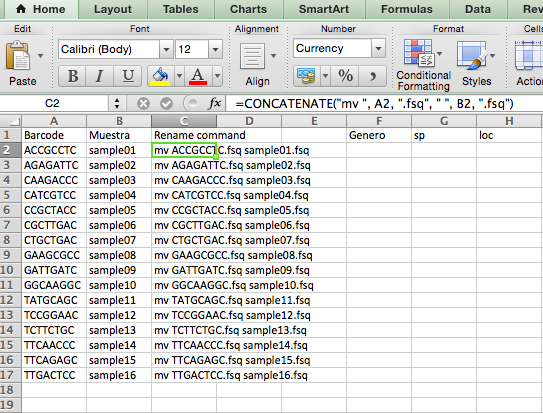

# Solución del primer examen parcial

#### Cuáles de los siguientes comandos puedo utilizar para ver el contenido (o parte de) de un archivo

```

cat

less

head

more

```

#### Si quiero ver los archivos de un directorio y el tamaño de cada archivo puedo usar (escoge todas las que apliquen)


```

ls -l

ls -lh

```

#### ¿Por qué es buena idea usar relative paths en nuestros scripts?

Para que puedan ser ejecutados con facilidad desde otras computadoras o usuarios sin tener que modificar el PATH del script

#### Asumiendo que te encuentras en el directorio BioinfInvRepro2016-II/Practicas/Uni2/Tomates/VerdesFritos ¿Cómo puedes ver el contenido de Practicas sin utilizar cd?


`ls ../../..` o `ls ../../../`

#### Dryad permite conectar los datos de un repositorio con los datos genéticos ya depositados en NCBI.

TRUE

#### ¿Qué info debe contener el README de un repositorio de datos y de un repositorio de código? (especifica para ambos casos)

Un README de un repositorio de código debe incluir:
-Que hay
-Que hace el código
-Como ejecuta la tarea el código (Qué archivos necesita, en qué orden, en qué software y versión del mismo etc.)

Un readme de un repositorio de datos debe incluír:
-Tipo de datos (RADsec, GBS, etc).
-Información sobre los datos (lat, long, info de cada muestra, etc)
-Procesamiento de los datos crudos (Trimming, filtrado por calidad, demultiplex, etc.; incluyendo versión del software y parámetros utilizados)

En ámbos casos, es una buena idea ligarlos a la publicación de la que provienen.


#### ¿Con qué comando puedo ver el path del directorio donde me encuentro?

`pwd`

#### ¿Con qué línea de comando puedo hacer que un archivo ejecutable llamado miscript.sh DEJE de ser ejecutable (para el usuario)?


`chmod u-x miscript.sh`


#### Escribe una línea de comando que te permita contar (imprimir en pantalla) cuántas muestras hay de la categoría de gran altitud (Alt) dentro del archivo /Practicas/Uni3/Ejstacks/stacks/PopMapAll.txt Asume que te encuentras en el directorio stacks.

`grep -o Alt PopMapAll.txt | wc -l`

`grep -c Alt PopMapAll.txt`

Si tienen algo parecido a lo anterior que funciona en sus equipos y no se las califiqué con todos los puntos avisarme.

#### Escribe una sola línea de comando que te permita obtener todas las muestras del estado de Durango (Dgo) que se encuentran en el archivo  /Practicas/Uni3/Ejstacks/stacks/PopMapAll.txt y escribirlas a un archivo llamado muestrasDgoAlt.txt que se guarde en el directorio /Ejstacks. Asume que te encuentras dentro del directorio /stacks


`grep -oE "Dgo\w+" PopMapAll.txt > ../muestrasDgo.txt`

(notese el `../`)

Ojo la respuesta que a algunos les salió originalmente en su examen calificado:

`grep -oE DgoAlt[0-9]* PopMapAll.txt > ../muestrasDgo.txt`

Aplica sólo si quisieran las muestras de Durango categoría alto (que era la pregunta original pero la edité sin guardar el cambio de respuesta)


#### ¿Cuál de los siguientes operadores redirige el stdout a un archivo nuevo sin sobrescribir su contenido si el archivo ya existe?

`>>`


#### Escribe un for loop que cree 3 directorios y que dentro de cada uno de ellos guarde una secuencia de proteína bajada de NCBI mediante un comando. El nombre del archivo fasta debe ser igual que el nombre del directorio más la terminación .fasta

```

for i in 50604368 50604366 6634488; do
mkdir prot$i
curl -s "http://eutils.ncbi.nlm.nih.gov/entrez/eutils/efetch.fcgi?db=protein&rettype=fasta&id=$i" > prot$i/prot$i.fasta
done
```


#### Escribe un for loop que cree 1000 archivos llamados elefante1, elefante2... y así sucesivamente. Cada uno de estos archivos debe contener el texto "x elefante(s) se columpiaban sobre la tela de una araña" donde x debe coincidir con el número de archivo.

```

for i in {1..1000}; do
echo "$i elefante(s) se columpiaban sobre la tela de una araña" > elefante$i.txt
done
```


#### Escribe un script que concatene en un sólo archivo llamado tomates.fasta los archivos jitomate.fasta y tomatesverdes.fasta (están en /Practicas/Uni2/Tomates) y que luego cuente cuantas secuencias de Solanum hay en el archivo tomates.fasta. El resultado de la cuenta debe imprimirse en pantalla (no en un archivo)

```
#! /bin/bash

# concatenar los archivos y crear uno nuevo
cat jitomate.fasta tomatesverdes.fasta > tomates.fasta
# grep para extraer "Solanum" y pipe para contar cuántos Solanum
grep -oE "Solanum" tomates.fasta | wc -l
```

Otra alternativa, con `grep` solito:

```
#! /bin/bash

# Este script concatena en un solo archivo las jitomates.fasta y tomatesverdes.fasta

# Concatenar
cat *.fasta > tomates.fasta

#Cuenta la cantidad de Solanum en el file
grep -c Solanum tomates.fasta
```

#### Dentro de la carpeta Examen1/muestras encontrarás una serie de archivos con nombres como AATCAGTC.fs.

#### 1) Escribe un script en el recuadro de abajo que cambie el nombre de los 15 primeros archivos (asumiendo orden alfabético) a muestra01, muestra02 y así sucesivamente.

#### 2) Asumiendo que tu script se llame renameSamples.sh ¿Qué linea de comando ocuparías para correrlo sin hacerlo un ejecutable?


```
#! /bin/bash

#cambiar el nombre de los archivos de forma manual
mv AATCAGTC.fs muestra01.fs
mv ACCGCCTC.fs muestra02.fs
mv AGAGATTC.fs muestra03.fs
mv CAAGACCC.fs muestra04.fs
mv CATCGTCC.fs muestra05.fs
mv CCGCTACC.fs muestra06.fs
mv CGCTTGAC.fs muestra07.fs
mv CTGCTGAC.fs muestra08.fs
mv GAAGCGCC.fs muestra09.fs
mv GATTGATC.fs muestra10.fs
mv GGCAAGGC.fs muestra11.fs
mv TATGCAGC.fs muestra12.fs
mv TCCGGAAC.fs muestra13.fs
mv TCTTCTGC.fs muestra14.fs
mv TTCAACCC.fs muestra15.fs
```


`bash renameSamples.sh`

Una manera fácil de hacer este tipo de cosas es con la función `CONCATENATE` de Excel/LibreOffice etc:




