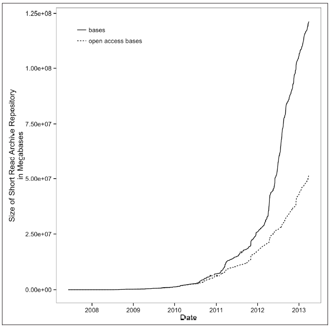
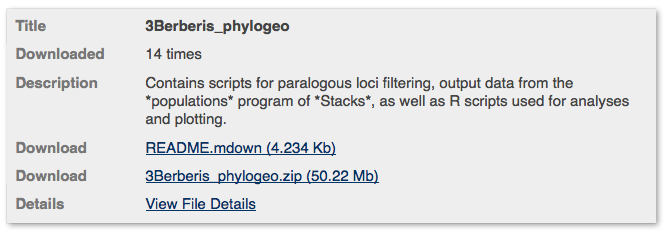
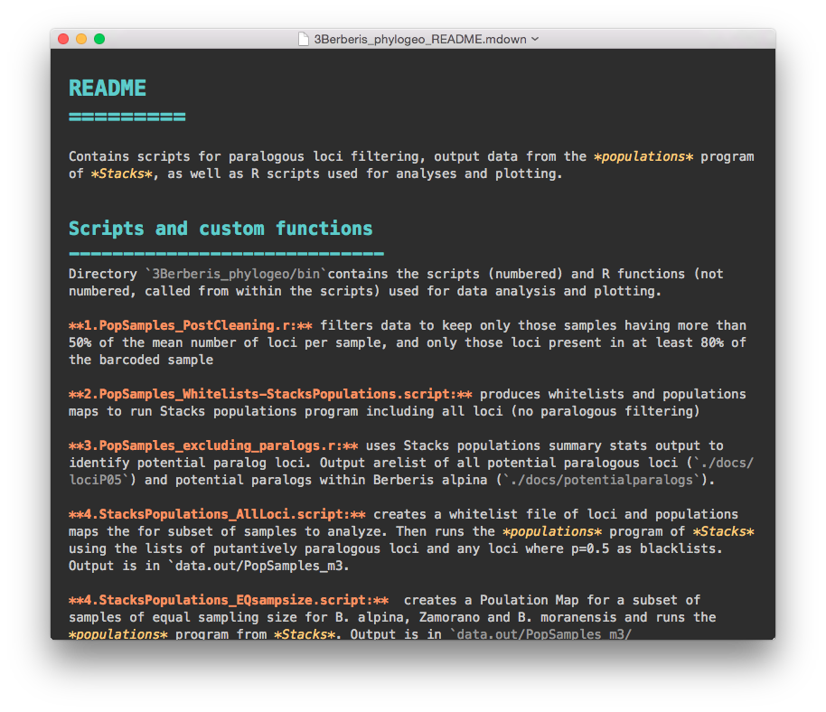

# Unidad 1 Bioinformática e investigación reproducible 

Lecturas para esta unidad: 

* Ideology: Data Skills for Robust and Reproducible Bioinformatics. Capítulo 1 de Buffalo V (2015) Bioinformatics data skills.
    
* http://ropensci.github.io/reproducibility-guide/sections/checklist/

## Biología y computadoras:

* **Biología Computacional**: estudio dela biología utilizando cómputo. Su objetivo es generar conocimiento biológico. 
    * Utilizar las herramientas hechas por alguien más para contestar tus preguntas.

* **Bioinformática**: creación de herramientas (algoritmos, software) para solucionar problemas con datos biológicos. 
    * Generar tus propias herramientas para contestar tus preguntas.

Como biólogo/as evolutivos utilizamos ambas:

 La mayoría de la investigación que se publica recientemente utilizó una mezcla de los programas de alguien más (sobretodo en los primeros pasos del procesamiento de datos) y después se utilizan *funciones*  propias para realizar análisis más específicos. 

Este curso empieza por biología computacional y deriba en la posibilidad de que crees tu propio código para analizar tus datos. 

Aunque la Biología Computacional y la Bioinformática no son lo mismo, tienen mucho en común y se apreden juntas. De aquí en adelante me referiré a análisis bioinformáticos, pero implica ambos tipos de disciplinas.

## 1.1. Reproducibilidad y documentación de análisis bioinformáticos

#### Investigación reproducible
Hacer **investigación reproducible** es poder repetir y obtener los mismos resultados de un trabajo científico. Para esto es necesario **que el producto de la investigación incluya**:

* Artículo científico (o tesis),
* Descripción de materiales y métodos,
* Datos utilizados,
* Código de cómputo utilizado,
* Versión del software utilizado,
* Cualquier otra información necesaria para repetir los experimentos y análisis

#### Reproducibilidad en bioinformática 
* Datos genéticos: 
    * Big Data
    * Mucha información, y creciendo

*Crecimiento del Short Read Archive. Tomado de Buffalo (2015)*

    * Requieren procesamiento intermedio de datos crudos a los datos en las figuras.
* Análisis de datos genéticos requieren forzosamente bioinformática y/o biología computacional. 
* Por lo tanto:
   - Depeden de software especializado 
   - Sus resultados pueden varias dependiendo de las (muchas) opciones y parámetros utilizados
   - La descripción en "Métodos" no basta para poder repetir el análisis
* **El código** 
   - Es indispensable para poder **repetir** y **mejorar** los análisis 
   - Puede arrojar errores "silenciosos" que sin embargo afecten significativamente los resultados

* Dos reglas de la bioinformática:
   - Si entra basura, basura sale.
   - Jamás de los jamaces confíes en tus herramientas (*The Golden Rule of Bioinformatics* de Buffalo).

 
#### ¿Reproducible para quién?

**1. Quién hizo la investigación, 6 meses (ó 6 días) después**

Evitar:

* ¿Cómo chingaos era esto?
* El archivo bueno es final.xlsx. No, espera, tal vez sea final_elbueo.xlsx. Deja reviso la última fecha de modificación. Hum....
* Ahorita me acuerdo.

Ganar:

* Volver a correr fácilmente los mismos datos con pequeñas modificaciones a los parámetros o datos input.
* Reutilizar código o datos para nuevos análisis
* Confianza en tus resultados

**2. Tus colegas y asesor/a**

No temer decir que sí a:

* ¿Me ayudas a hacer este análisis?
* ¿Puedes repetir esta gráfica agregando este dato nuevo? 

**3. La comunidad científica**

* Corroborar resultados
* Construir sobre lo construido

## 1.2. Repositorios de datos

### ¿Materiales suplementarios?
Supplementary materials have size limitations and do not always provide optimal file and viewing formats, particularly for large and complex data sets. But where no repository — or publication focused on detailed descriptions of data sets — exists, supplementary materials have often been the best option

### NCBI and SRA
Sequence Read Archive (SRA) 

### Dryad

ommunity-supported, specialized data repositories are usually the best way to share large data sets. General, unstructured repositories, such as figshare and Dryad, provide options where no community repository exists, and are preferable to publishing data as Supplementary Information. .

Checa otros repositorios de datos [aquí](http://ropensci.github.io/reproducibility-guide/sections/dataStorage/).

#### Artículos de datos
Scientific Data’s peer-review and in-house curation processes focus on ease of reuse. A data-curation editor reviews data files, checks their format, archiving and annotations, and works with authors to produce a standardized, machine-readable summary of the study in the ISA-Tab format

Data papers
http://www.nature.com/sdata/about/principles

### Un buen README 

* "Leeme".
* Un archivo de texto (no Word, pero puede ser MarkDown) que detalla:
   * **Qué hay** dentro del repositorio (y cada uno de sus directorios).
   * **Qué hacen** cada una de las funciones/scripts del repositorio
   * **Cómo y en qué órden** deben ocuparse los scripts para realizar los análisis
* Ejemplo:
    * [Este](http://datadryad.org/resource/doi:10.5061/dryad.n3jk5
) repositorio de datos está dividido en varias secciones. La 3ra se ve así:

Y si abres el README.mdwon verás algo así (los colores y el fondo negro son porque lo abrí con el editor MacDown, pero es un vil archivo de texto):

 

** Ejercicio ** Prueba visualizar el archivo README.mdown del repositorio anterior con un editor de texto, con un editor de MarkDown y con un visualizador de MarkDown.

## 1.3. Código en computación

* Instrucciones escritas **para una computadora** en un **lenguaje de cómputo**   
* Paso por paso hasta una solución.
* El código es uno o varios **archivos de texto** (¡NO WORD!, *plain text*).
* El código puede ser muy largo y formar un programa (**software**) entero o de una sóla línea para realizar una única operación.
* Escribir código para que lo ejecuten las computadoras y **comentado** para seres humanos.

¿Cómo escribir comentarios en el código?
En la mayoría de los lenguajes de programación el texto a la derecha de un `#` **no se ejecuta**.

EJEMPLOS 

## 1.4. Scripts y repositorios de código

### ¿Por qué compartir nuestro código?

* Reproducibilidad de la cienica
* Construir sobre lo construído y hacer mejor el código antes. Más en el artículo: 
 [Openness makes software better sooner](http://www.nature.com/news/2003/030623/full/news030623-6.html)

### Excusas comunes para no compartir nuestro código
* Me da pena que vean mi código
* No quiero que otros saquen provecho de mi código, me pertenece o a mi institución
* Otros no publican su código ¿por qué yo sí?
* Me da flojera pulir mi código para publicarlo
* Si publico mi código le van a encontrar errores y demandar correcciones o ayuda

Si respondiste sí (o tus colaboradores) a cualquiera de los anteriores checa esta lectura recomendada: [Publish your computer code: it is good enough](http://www.nature.com/news/2010/101013/full/467753a.html) de Nick Barnes.

### ¿Cómo compartir código?

* Scripts **comentados** y con un **README**
* Repositorio de código
   * Dryad (como parte del repositorio de datos)
   * [GitHub](https://github.com/) (mejor para funciones y projectos que continuarán actualizándose).

### GitHub
 

