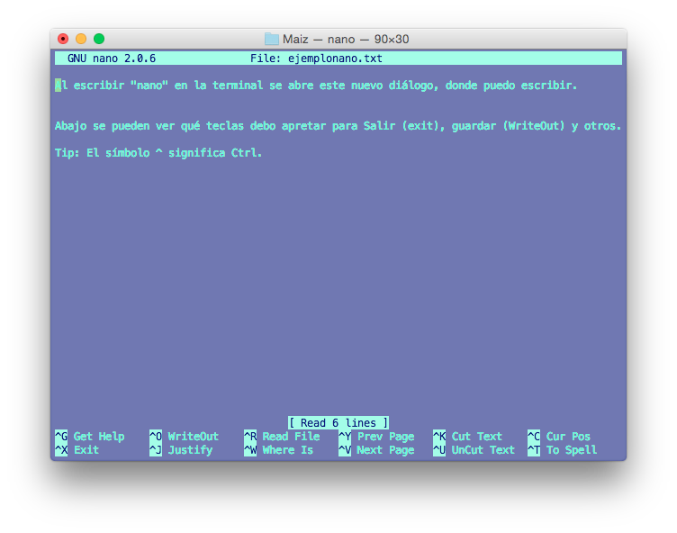

# Unidad 2 Introducción a Unix Shell

## 2.1. Introducción a la Consola y Línea de Comando


La terminal y Unix

En tu terminal verás algo así:


La primera línea dice la fecha y hora y "ttys001". ttys viene de "Teletype" ([un poco de historia aquí](http://stackoverflow.com/questions/4532413/what-is-tty-on-freebsd)) y significa que el *input* es nuestro teclado, identificado como ttys001. 

En mi caso la segunda línea me dice que tengo correo. Uds probablemente no tengan esto.

La tercera línea es la más importante: dice el **nombre del equipo** (Aliicas-MacBook-Pro en este caso), el **directorio** donde estoy (`~` signfica "home directory", lo veremos más adelante) y el **nombre del usuario** con quién estoy en la terminal (en mi caso ticatla). 

Notarás que la tercera línea termina en `$`

`$` significa que la terminal está corriendo con un interpretador Shell o Bash y por un usuario sin mayores privilegios. Si termina en `#` significa que la estás corriendo como **root** que es un "súper usuario" con permisos para desconfigurarlo todo, ten cuidado. 


#### ¿Qué signficica que La Terminal tenga un interpretador? 

Que le damos comandos y nos responde. 

El la Terminal no existe el *point and click*. El que funcione como una Línea de Comando significa que tienes que darle comandos de qué hacer línea por línea. 

Por ejemplo:

`date` nos responde la fecha actual

`echo algo` nos responde el texto "algo". También lo puedes utilizar con más de una palabra. 

Algo así debe verse tu terminal:


Pero por practicidad y para facilitar el copiar-pegar en vez de la imágen de la Terminal pondré los comandos (código) y sus resultados, así:

```
Alicias-MacBook-Pro:~ ticatla$ date
Sat 23 Jan 2016 14:46:06 CST
Alicias-MacBook-Pro:~ ticatla$ echo algo
algo
Alicias-MacBook-Pro:~ ticatla$ echo hello world
hello world
```

Que es lo mismo que:

```
$ date
Sat 23 Jan 2016 14:46:06 CST
$ echo algo
algo
$ echo hello world
hello world
``` 
 
Para facilidad visual, de aquí en adelante utilizaremos la opción con el texto a partir de `$` (al menos que sea pertiente ver lo que hay antes). Este tipo de formato te lo encontrarás en diversos foros de ayuda, libros de textos y manuales.
 

**Pregunta**: ¿Qué pasa si intentas correr el comando  `algo`?:

La terminal dirá:

    -bash: algo: command not found

Que quiere decir que no existe el comando `algo`. 



## 2.2. Funciones básicas de navegación y manejo de archivos y directorios
Windows, Mac y las interfases gráficas de Linux (como Ubuntu y Biolinux) tienen un sistema de archivos que estamos acostumbrados a explorar a través carpetas y subcarpetas que podemos ver en una ventana. Por ejemplo así:

 

A continuación vamos a ver cómo navegar por este **mismo** sistema de archivos, pero desde la Terminal y con el telcado en vez de desde una ventana y con clicks.

### `pwd`

`pwd` nos da el directorio en donde estamos (viene de print **working directory**). 

El directorio de trabajo es **dónde estamos**, equivalente a tener una ventana abierta del explorador en una carpeta determinada. Al menos que le indiques lo contrario, todo archivo que se genere como parte de la ejecución de un programa se guardará aquí. También este será el lugar donde cualquier programa/script buscará los archivos que le pidas, y NO los encontrará si no están exactamente ahí. Claro que es posible decirle que busque en otro directorio, lo veremos adelante.  

El working directory de base es la carpeta "home" del usuario de la computadora. En mi caso:

    $ pwd
    /Users/ticatla
 
La diagonal **/** es el símbolo que separa los directorios en niveles jerárquicos. Es decir `ticatla` es un subdirectorio de `Users` que a su vez es un subdirectorio de `root` (simbolizado aquí como una sola /), la raíz de todos los directorios.

### `cd`

`cd` viene de **change directory** y sirve para movernos a otro directorio. Para esto hay varias opciones:

#### Moverse hacia adelante/abajo (i.e. adentro de subdirectorios):

* **Absolute path** que es dar la ruta (dirección) completa **desde root** hasta el directorio que queremos.

* **Relative path** que es dar la ruta **desde donde estamos** hasta el directorio que queremos.

Ejemplo de ruta absoluta:

```
Alicias-MacBook-Pro:~ ticatla$ cd /Users/ticatla/Desktop/BioinfInvRepro2016-II/Practicas/
Alicias-MacBook-Pro:Practicas ticatla$

```
**Pregunta:** ¿Qué pasa con el texto antes del nombre de usuario?

Como se explicó antes, el texto antes de `$` nos indica el nombre del equipo, el directorio actual y el nombre del usuario. El directorio actual cambió de "ticatla" (home) a "Practicas". 


#### Moverse a home:

`~` es una especie de ruta corta a la ruta absoluta de tu directorio home. No importa dónde estés `cd ~` te llevará a home. 


```
Alicias-MacBook-Pro:Practicas ticatla$ cd ~
Alicias-MacBook-Pro:~ ticatla$ 
```

Ejemplo de ruta relativa:

```
Alicias-MacBook-Pro:Practicas ticatla$ cd ~
Alicias-MacBook-Pro:~ ticatla$ cd Desktop/BioinfInvRepro2016-II/Practicas/
Alicias-MacBook-Pro:Practicas ticatla$ 
```

#### Moverse para atrás (hacia el directorio raíz):

Igual puede ser con rutas absolutas o relativas, pero utilizando `..` que representa **parent directory**, es decir el directorio arriba (o atrás, como le entiendas mejor):

`cd ..` por lo tanto te lleva a un directorio arriba de donde estés.

Ejemplo:


```

$ pwd
/Users/ticatla/Desktop/BioinfInvRepro2016-II/Practicas
$ cd ..
$ pwd
/Users/ticatla/Desktop/BioinfInvRepro2016-II


```

#### Moverse para atrás y para adelante en la misma línea

Puedes usar `..` muchas veces. Ojo con incluir `/` para separar niveles. 

Ejemplo:

```
$pwd
/Users/ticatla/Desktop/BioinfInvRepro2016-II/Practicas/Uni2/Tomates/VerdesFritos
$ cd ../../Manzanas/
$ pwd
/Users/ticatla/Desktop/BioinfInvRepro2016-II/Practicas/Uni2/Manzanas

```

Es decir `../` se puede combinar con una ruta relativa. Ejemplo:

```
$ pwd
/Users/ticatla/Desktop/BioinfInvRepro2016-II/Practicas/Tomates/VerdesFritos
Alicias-MacBook-Pro:VerdesFritos ticatla$ cd ../../Manzanas
Alicias-MacBook-Pro:Manzanas ticatla$ 
```

#### No moverse
O en otras palabras ir al directorio donde ya estás. Suena inútil, y en general lo es si lo hace con `cd`, pero el concepto es importante para otros comandos que veremos más adelante. 

`cd ./` te lleva al directorio en el que estás. Lo imporante a recordar es que `.` significa "el directorio actual". 


#### Errores comunes al usar `cd`

* `-bash: cd: manzanas: No such file or directory`

 ¿Escribiste bien Manzanas? Ups. No. Es Manzanas no manzanas. Ojo con las mayúsculas. También aguas con  los errores de dedo (e.g. Manzaanas arrojaría el mismo error)

* `-bash: cd: ../Manzanas: No such file or directory`


  Sí está bien escrito, el directorio Manzanas existe y no lo encuentra. Ok, existe, pero NO en el directorio inmediatamente arriba. Checa dónde estás y a dónde dirigien tus `cd ..`

* `-bash: cd..: command not found`. 
  
  Ojo, con tus espacios `cd..` no es lo mismo que `cd ..`. Otro clásico es poner `cd ...`


En resumen: checa que esté bien escrito y que puedas ir a ese diretorio con la ruta que le estás pidiendo. 

#### Tips de acceso rápido en la Terminal

**Flecha arriba/abajo** para acceder a los últimos comandos utilizaods
**TAB** para "completar" la escritura del path o nombre de archivos.


## `ls`

Enlista los archivos y directorios presentes en un directorio. Ejemplo:

```
$ cd Maiz
$ ls
nuevos_final.bed	nuevos_final.fam
nuevos_final.bim	nuevos_final.log
```

Nota que los enlista en órden alfabético. 

Para tener más info de los archivos:

`ls -l` brinda la misma lista, pero con datos sobre: 
si es un directorio (d) o un archivo (-), permisos (si es sólo lectura, editable, etc y por quién, detalles más adelante), número de links al archivo, qué usuario es el dueño, a qué grupo pertenece dicho usuario, tamaño en bytes, fecha-hora en que se modificó y el nombre del directorio o archivo.

Ejemplo:

```
$ ls -l
total 5216
-rwx------  1 ticatla  staff  1551105  6 May  2015 nuevos_final.bed
-rwx------  1 ticatla  staff  1109078  6 May  2015 nuevos_final.bim
-rwx------  1 ticatla  staff     3604  6 May  2015 nuevos_final.fam
-rwx------  1 ticatla  staff     1825  6 May  2015 nuevos_final.log

```

Pero se pueden ordenar por fecha (y hora, aunque no se vea) de modificación, por ejemplo:

```
$ ls -lt
total 5216
-rwx------  1 ticatla  staff     1825  6 May  2015 nuevos_final.log
-rwx------  1 ticatla  staff     3604  6 May  2015 nuevos_final.fam
-rwx------  1 ticatla  staff  1551105  6 May  2015 nuevos_final.bed
-rwx------  1 ticatla  staff  1109078  6 May  2015 nuevos_final.bim
```


`man ls` abre el manual de `ls` (**o de cualquier otro comando**), donde vienen muchas más opciones para usar este comando.

**Tip**: presiona "q" para salir de la pantalla de `man`. 

**Ejercicio**:
* Enlista el contenido de `Maiz` por tamaño del archivo y has que el tamaño del archivo se lea en KB y MB (ie reducido en vez de todos los bytes).

### `mkdir`

Crea un directorio. 

```
$ mkdir Prueba
$ ls
Prueba			nuevos_final.bim	nuevos_final.log
nuevos_final.bed	nuevos_final.fam
```

Nota: Se puede combinar con paths absolutos o relativos para crearlo en un directorio diferente al WD.


**Ejercicio:** ¿Qué pasa si intentas crear un directorio que ya existe? ¿Para qué sirve el flag `-p`?


### `cp`

Copia un archivo o directorio de lugar A a lugar B.

```
$ cp -r Prueba ../
$ ls ../
Maiz		Manzanas	Peras		Prueba		Tomates
```

¿Por qué utilicé el flag `-r` en el ejemplo anterior?


### `mv`

Mueve un archivo o directorio de lugar A a lugar B. Equivalente a "copy-paste".

```
$ mv ../Prueba ../Manzanas
$ ls ../
Maiz		Manzanas	Peras		Tomates
$ ls ../Manzanas
Prueba

```

Nota que con `mv` no es necesario utilizar `-r` para borrar directorios.


### `rm`

Borra (**AGUAS al usar esto**) archivos o directorios.

```
$ rm -r Prueba
$ rm -r ../Manzanas/Prueba
```

**Pregunta:** ¿Si borras un directorio se borra su contenido? 


### `tar`

Es un método de ultra comprensión (más que zip) utilizado por sistemas Linux/Unix. Viene de "*tape archive*" y originalmente surgió para comprimir archivos para los discos "tape" de respaldo. 

La compresión tar genera archivos "tarball", gzip y bzip. Con terminaciones como `.tar.gz`.

#### Crear un tar.gz

Imaginemos que queremos comprimir la carpeta `Maiz`

```
cd ..
$ ls
Maiz		Manzanas	Peras		Tomates
tar cvzf Maiz.tar.gz Maiz
Maiz/
Maiz/.DS_Store
Maiz/nuevos_final.bed
Maiz/nuevos_final.bim
Maiz/nuevos_final.fam
Maiz/nuevos_final.log
$ls -lhS
total 2528
-rw-r--r--  1 ticatla  staff   1.2M  3 Feb 08:27 Maiz.tar.gz
drwxr-xr-x  7 ticatla  staff   238B  3 Feb 08:11 Maiz
drwxr-xr-x  4 ticatla  staff   136B 23 Jan 14:59 Tomates
drwxr-xr-x  2 ticatla  staff    68B  3 Feb 08:12 Manzanas
drwxr-xr-x  2 ticatla  staff    68B 23 Jan 14:19 Peras

```
¿Qué hacen los flags de `tar` que utilizamos?

`c`  Crea un nuevo archivo .tar.

`v`  Muestra "*Verbosely*" el progreso de la compresión.

`z`  Especifica que queremos un `.gzip`.

`f`  Nombre del archivo tar que queremos como resultado.

#### Descomprimir (Untar) archivos .tar.gz

```
$ rm -r Maiz
$ tar -xvf Maiz.tar.gz
Maiz/
Maiz/.DS_Store
Maiz/nuevos_final.bed
Maiz/nuevos_final.bim
Maiz/nuevos_final.fam
Maiz/nuevos_final.log
$ ls
Maiz		Maiz.tar.gz	Manzanas	Peras		Tomates
```

**Pregunta:** ¿Qué hacen las flags `-xvf`?

#### Ver el contenido de un archivo tar SIN descomprimirlo

```
tar -tvf Maiz.tar.gz
drwxr-xr-x ticatla/staff     0 2016-02-03 08:11 Maiz/
-rw-r--r-- ticatla/staff  6148 2016-02-03 07:46 Maiz/.DS_Store
-rwx------ ticatla/staff 1551105 2015-05-06 10:05 Maiz/nuevos_final.bed
-rwx------ ticatla/staff 1109078 2015-05-06 10:05 Maiz/nuevos_final.bim
-rwx------ ticatla/staff    3604 2015-05-06 11:06 Maiz/nuevos_final.fam
-rwx------ ticatla/staff    1825 2015-05-06 12:19 Maiz/nuevos_final.log

```

**Pregunta:** ¿En qué situación puede ser útil ver el contendio de un tar sin descomprimirlo?

[Aquí una guía con más opciones para usar `tar`](http://www.tecmint.com/18-tar-command-examples-in-linux/)

## Crear archivos desde la terminal

Es posible crear archivos de texto directamente desde la terminal utilizando programas como **vim** y **nano**. 


Ejemplo. :
```
$ cd Maiz
$ nano
```

Y abrirá una nueva ventana, donde pueden escribir así:



Al guardar con `^O` pedirá un nombre de archivo. Yo lo guardé como "ejemplonano.txt". 

Una vez fuera de nano podemos verlo en la Terminal y volverlo a abrir si queremos:

```
$ ls 
ejemplonano.txt		nuevos_final.bim	nuevos_final.log
nuevos_final.bed	nuevos_final.fam
$ nano ejemplonano.txt
```


## Comodies o el uso de `*` `?` `[]` `{}` 

Volvamos a ver el contenido de Maiz:

```
$ cd Maiz
$ ls 
ejemplonano.txt		nuevos_final.bim	nuevos_final.log
nuevos_final.bed	nuevos_final.fam
```

**Ejercicio**: Necesitamos crear más archivos .bed y .fam para los ejemplos de abajo. Queremos qué se llamen `ejemplo_final.bed` y `ejemplo_final.fam`. ¿Cómo hacerlo?


El resultado del ejercicio anterior es:

```
$ ls
ejemplo_final.bed	nuevos_final.bed	nuevos_final.log
ejemplo_final.fam	nuevos_final.bim
ejemplonano.txt		nuevos_final.fam
```

Fácilmente podemos ver que hay 7 archivos, y que hay dos que terminan en .bed y dos que terminan en .fam. 


¿Y si tubieramos 1,000 archivos con las terminaciones .bed, .fam, bim pero con diferente prefijo? ¿Cómo contarlos y ver cuántos .bed hay?

### `*`

"Comodín" o *wildcard*. Caulquier texto (uno o más caracteres) a partir (dercha o izquierda) de dónde se ponga el `*`.

Ejemplo:

```
$ ls *.bed
ejemplo_final.bed	nuevos_final.bed
$ ls nuevos*
nuevos_final.bed	nuevos_final.fam
nuevos_final.bim	nuevos_final.log

``` 


### `?`
Parecido a ´*´ pero para un sólo caractér.

```
$ ls *.b??
ejemplo_final.bed	nuevos_final.bed	nuevos_final.bim
```

### `[]`

Para agrupar términos de búsqueda. Por ejemplo letras [a-z]

```
$ ls [a-z]*.bed
ejemplo_final.bed	nuevos_final.bed
```

Hay más comodines, puedes explorarlos [aquí](http://tldp.org/LDP/GNU-Linux-Tools-Summary/html/x11655.htm).


http://tldp.org/LDP/abs/html/x17129.html



## 2.3. Funciones básicas de exploración de archivos

### `more`

Nos permite ver el archivo una línea (flecha abajo) o página a la vez (barra espaciadora). Para salir: `q` 

```
$ more nuevos_final.fam
1 maiz_3 0 0 0 -9
2 maiz_68 0 0 0 -9
3 maiz_91 0 0 0 -9
4 maiz_39 0 0 0 -9
5 maiz_12 0 0 0 -9
6 maiz_41 0 0 0 -9
7 maiz_35 0 0 0 -9
8 maiz_58 0 0 0 -9
9 maiz_51 0 0 0 -9
10 maiz_82 0 0 0 -9
11 maiz_67 0 0 0 -9
12 maiz_93 0 0 0 -9
13 maiz_21 0 0 0 -9
14 maiz_6 0 0 0 -9
15 maiz_101 0 0 0 -9
16 maiz_27 0 0 0 -9
17 maiz_43 0 0 0 -9
18 maiz_1 0 0 0 -9
19 maiz_33 0 0 0 -9
20 maiz_100 0 0 0 -9
21 maiz_24 0 0 0 -9
22 maiz_103 0 0 0 -9
23 maiz_72 0 0 0 -9
24 maiz_10 0 0 0 -9
25 maiz_28 0 0 0 -9
26 maiz_49 0 0 0 -9
27 maiz_56 0 0 0 -9
28 maiz_66 0 0 0 -9
29 maiz_52 0 0 0 -9
nuevos_final.fam 
```

Dentro de `more` podemos escribir `/` y luego texto, mismo que será buscando dentro del archivo. 

**Ejercicio**: En el archivo que estamos viendo hay unas muestras de teocintles cuyos nombres empiezan con "teos". ¿En qué líneas del documento están?


### `less`
Igual que `more` pero también nos permite moverse hacia atrás (flecha arriba).


### `head`

Muestra las primeras 10 líneas de un archivo

```
$ head nuevos_final.fam
1 maiz_3 0 0 0 -9
2 maiz_68 0 0 0 -9
3 maiz_91 0 0 0 -9
4 maiz_39 0 0 0 -9
5 maiz_12 0 0 0 -9
6 maiz_41 0 0 0 -9
7 maiz_35 0 0 0 -9
8 maiz_58 0 0 0 -9
9 maiz_51 0 0 0 -9
10 maiz_82 0 0 0 -9
```
### `tail`

Muestra las últimas líneas de un archivo.

**Pregunta:** ¿Para qué podría ser útil ver las últimas líneas de un archivo?

### ´wc´
Brinda el número de líneas, el número de palabras y el número de caractéres del archivo.

```
$ wc nuevos_final.fam
     165     990    3604 nuevos_final.fam
```

### ´cat´

Viene de *Concatenate*. Sirve para unir uno detrás de otro varios archivos.

``` 
$ cat nuevos_final.fam *log
1 maiz_3 0 0 0 -9
2 maiz_68 0 0 0 -9
3 maiz_91 0 0 0 -9
4 maiz_39 0 0 0 -9
5 maiz_12 0 0 0 -9
6 maiz_41 0 0 0 -9
7 maiz_35 0 0 0 -9
8 maiz_58 0 0 0 -9
9 maiz_51 0 0 0 -9
10 maiz_82 0 0 0 -9
11 maiz_67 0 0 0 -9
12 maiz_93 0 0 0 -9
13 maiz_21 0 0 0 -9
14 maiz_6 0 0 0 -9
15 maiz_101 0 0 0 -9
16 maiz_27 0 0 0 -9
17 maiz_43 0 0 0 -9
18 maiz_1 0 0 0 -9
19 maiz_33 0 0 0 -9
20 maiz_100 0 0 0 -9
21 maiz_24 0 0 0 -9
22 maiz_103 0 0 0 -9
23 maiz_72 0 0 0 -9
24 maiz_10 0 0 0 -9
25 maiz_28 0 0 0 -9
26 maiz_49 0 0 0 -9
27 maiz_56 0 0 0 -9
28 maiz_66 0 0 0 -9
29 maiz_52 0 0 0 -9
30 maiz_47 0 0 0 -9
31 maiz_80 0 0 0 -9
32 maiz_65 0 0 0 -9
33 maiz_94 0 0 0 -9
34 maiz_36 0 0 0 -9
35 maiz_26 0 0 0 -9
36 maiz_105 0 0 0 -9
37 maiz_30 0 0 0 -9
38 maiz_16 0 0 0 -9
39 maiz_42 0 0 0 -9
40 maiz_4 0 0 0 -9
41 maiz_31 0 0 0 -9
42 maiz_17 0 0 0 -9
43 maiz_46 0 0 0 -9
44 maiz_5 0 0 0 -9
45 maiz_32 0 0 0 -9
46 maiz_19 0 0 0 -9
47 maiz_50 0 0 0 -9
48 maiz_8 0 0 0 -9
49 maiz_34 0 0 0 -9
50 maiz_23 0 0 0 -9
51 maiz_54 0 0 0 -9
52 maiz_14 0 0 0 -9
53 maiz_37 0 0 0 -9
54 maiz_25 0 0 0 -9
55 maiz_55 0 0 0 -9
56 maiz_40 0 0 0 -9
57 maiz_29 0 0 0 -9
58 maiz_60 0 0 0 -9
59 maiz_44 0 0 0 -9
60 maiz_74 0 0 0 -9
61 maiz_89 0 0 0 -9
62 maiz_64 0 0 0 -9
63 maiz_83 0 0 0 -9
64 maiz_75 0 0 0 -9
65 maiz_92 0 0 0 -9
66 maiz_69 0 0 0 -9
67 maiz_84 0 0 0 -9
68 maiz_76 0 0 0 -9
69 maiz_97 0 0 0 -9
70 maiz_70 0 0 0 -9
71 maiz_85 0 0 0 -9
72 maiz_77 0 0 0 -9
73 maiz_71 0 0 0 -9
74 maiz_86 0 0 0 -9
75 maiz_78 0 0 0 -9
76 maiz_102 0 0 0 -9
77 maiz_73 0 0 0 -9
78 maiz_88 0 0 0 -9
79 maiz_79 0 0 0 -9
80 maiz_106 0 0 0 -9
81 maiz_119 0 0 0 -9
82 maiz_148 0 0 0 -9
83 maiz_108 0 0 0 -9
84 maiz_120 0 0 0 -9
85 maiz_151 0 0 0 -9
86 maiz_134 0 0 0 -9
87 maiz_123 0 0 0 -9
88 maiz_153 0 0 0 -9
89 maiz_135 0 0 0 -9
90 maiz_124 0 0 0 -9
91 maiz_184 0 0 0 -9
92 maiz_140 0 0 0 -9
93 maiz_125 0 0 0 -9
94 maiz_141 0 0 0 -9
95 maiz_131 0 0 0 -9
96 maiz_189 0 0 0 -9
97 maiz_57 0 0 0 -9
98 maiz_126 0 0 0 -9
99 maiz_113 0 0 0 -9
100 maiz_138 0 0 0 -9
101 maiz_63 0 0 0 -9
102 maiz_127 0 0 0 -9
103 maiz_114 0 0 0 -9
104 maiz_139 0 0 0 -9
105 maiz_99 0 0 0 -9
106 maiz_129 0 0 0 -9
107 maiz_116 0 0 0 -9
108 maiz_142 0 0 0 -9
109 maiz_110 0 0 0 -9
110 maiz_132 0 0 0 -9
111 maiz_118 0 0 0 -9
112 maiz_144 0 0 0 -9
113 maiz_133 0 0 0 -9
114 maiz_121 0 0 0 -9
115 maiz_111 0 0 0 -9
116 maiz_137 0 0 0 -9
117 maiz_109 0 0 0 -9
118 maiz_146 0 0 0 -9
119 maiz_164 0 0 0 -9
120 maiz_157 0 0 0 -9
121 maiz_171 0 0 0 -9
122 maiz_149 0 0 0 -9
123 maiz_165 0 0 0 -9
124 maiz_159 0 0 0 -9
125 maiz_172 0 0 0 -9
126 maiz_150 0 0 0 -9
127 maiz_166 0 0 0 -9
128 maiz_160 0 0 0 -9
129 maiz_173 0 0 0 -9
130 maiz_152 0 0 0 -9
131 maiz_167 0 0 0 -9
132 maiz_161 0 0 0 -9
133 maiz_174 0 0 0 -9
134 maiz_154 0 0 0 -9
135 maiz_169 0 0 0 -9
136 maiz_162 0 0 0 -9
137 maiz_176 0 0 0 -9
138 maiz_156 0 0 0 -9
139 maiz_170 0 0 0 -9
140 maiz_163 0 0 0 -9
141 maiz_177 0 0 0 -9
142 maiz_178 0 0 0 -9
143 maiz_192 0 0 0 -9
144 maiz_185 0 0 0 -9
145 maiz_201 0 0 0 -9
146 maiz_179 0 0 0 -9
147 maiz_193 0 0 0 -9
148 maiz_186 0 0 0 -9
149 maiz_202 0 0 0 -9
150 maiz_180 0 0 0 -9
151 maiz_195 0 0 0 -9
152 maiz_187 0 0 0 -9
153 maiz_181 0 0 0 -9
155 maiz_197 0 0 0 -9
156 maiz_188 0 0 0 -9
157 maiz_182 0 0 0 -9
158 maiz_198 0 0 0 -9
159 maiz_190 0 0 0 -9
160 maiz_200 0 0 0 -9
161 maiz_183 0 0 0 -9
162 maiz_191 0 0 0 -9
163 teos_96 0 0 0 -9
164 teos_203 0 0 0 -9
163 teos_911 0 0 0 -9
164 teos_9107 0 0 0 -9

@----------------------------------------------------------@
|        PLINK!       |     v1.07      |   10/Aug/2009     |
|----------------------------------------------------------|
|  (C) 2009 Shaun Purcell, GNU General Public License, v2  |
|----------------------------------------------------------|
|  For documentation, citation & bug-report instructions:  |
|        http://pngu.mgh.harvard.edu/purcell/plink/        |
@----------------------------------------------------------@

Web-based version check ( --noweb to skip )
Recent cached web-check found... OK, v1.07 is current

+++ PLINK 1.9 is now available! See above website for details +++ 

Writing this text to log file [ nuevos_final.log ]
Analysis started: Wed May 06 12:19:25 2015

Options in effect:
	--file nuevos_final
	--out nuevos_final
	--recodeA

36931 (of 36931) markers to be included from [ nuevos_final.map ]
Warning, found 165 individuals with ambiguous sex codes
Writing list of these individuals to [ nuevos_final.nosex ]
165 individuals read from [ nuevos_final.ped ] 
0 individuals with nonmissing phenotypes
Assuming a disease phenotype (1=unaff, 2=aff, 0=miss)
Missing phenotype value is also -9
0 cases, 0 controls and 165 missing
0 males, 0 females, and 165 of unspecified sex
Before frequency and genotyping pruning, there are 36931 SNPs
165 founders and 0 non-founders found
Total genotyping rate in remaining individuals is 0.990151
0 SNPs failed missingness test ( GENO > 1 )
0 SNPs failed frequency test ( MAF < 0 )
After frequency and genotyping pruning, there are 36931 SNPs
After filtering, 0 cases, 0 controls and 165 missing
After filtering, 0 males, 0 females, and 165 of unspecified sex
Writing recoded file to [ nuevos_final.raw ] 

Analysis finished: Wed May 06 12:19:30 2015
```

Es decir, básicamente es como copiar-pegar un archivo al final de otro. 


**Ejercicio** ¿Cómo concatenar tres o más archivos a la vez?


**Pregunta:** ¿Y si quisiéramos tener el resultado en un archivo nuevo?



## 2.4. Redirección

**Pregunta** ¿Qué son el Standar output y el Standar input?

###  `>` y `>>` 

Redirige el Standar output (*stdout*) a un archivo en vez de imprimirlo en pantalla.

```
$ cat nuevos_final.fam *log > catejemplo.txt
$ ls
catejemplo.txt		ejemplonano.txt		nuevos_final.fam
ejemplo_final.bed	nuevos_final.bed	nuevos_final.log
ejemplo_final.fam	nuevos_final.bim
$ head catejemplo.txt 
1 maiz_3 0 0 0 -9
2 maiz_68 0 0 0 -9
3 maiz_91 0 0 0 -9
4 maiz_39 0 0 0 -9
5 maiz_12 0 0 0 -9
6 maiz_41 0 0 0 -9
7 maiz_35 0 0 0 -9
8 maiz_58 0 0 0 -9
9 maiz_51 0 0 0 -9
10 maiz_82 0 0 0 -9
$ tail catejemplo.txt 
Total genotyping rate in remaining individuals is 0.990151
0 SNPs failed missingness test ( GENO > 1 )
0 SNPs failed frequency test ( MAF < 0 )
After frequency and genotyping pruning, there are 36931 SNPs
After filtering, 0 cases, 0 controls and 165 missing
After filtering, 0 males, 0 females, and 165 of unspecified sex
Writing recoded file to [ nuevos_final.raw ] 

Analysis finished: Wed May 06 12:19:30 2015
```

Nota que si el archivo catejemplo.txt ya existe será borrado por el comando anterior. Si no deseas que esto ocurra sino que el nuevo contenido se agrege al final de un archivo ya existente entonces usa  `>>`. Así:

```
$ cat nuevos_final.fam *log >> catejemplo.txt
```

### `|`
Toma el stdout de un comando y lo conviernte en el input de otro (*Pipes* the strout).

Ejemplo:

```
$ ls
catejemplo.txt		ejemplonano.txt		nuevos_final.fam
ejemplo_final.bed	nuevos_final.bed	nuevos_final.log
ejemplo_final.fam	nuevos_final.bim
$ ls | wc -l
       8
```  

Otro ejemplo (no se muestra el stdout pues es demasiado largo)

```
cat *.fam | more 
```

Más detalles y otras formas de redireccionar (que ocupan algunos programas) las puedes encontrar aquí [http://sc.tamu.edu/help/general/unix/redirection.html]()

## Regular expressions y búsqueda de patrones (`grep`)

Lo veremos la siguiente clase. Recomiendo traer leído:

Cap 2. y Cap 5 a partir de *Regular expressions at the command line with grep*. Ambos de Haddock SHD, Dunn CW (2011) Practical computing for biologists. Sinauer Associates Sunderland, MA.


## 2.5. Loops

Lo veremos la siguiente clase.