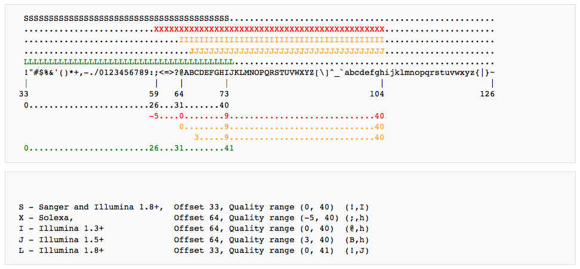

# Unidad 4 Datos genéticos utilizados en bioinformática 

Referencias recomendadas para esta Unidad:

* [Next Generation Sequencing (NGS)/Pre-Processing - Wikibooks, Open Books for an Open World (2014)](http://en.wikibooks.org/wiki/Next_Generation_Sequencing_(NGS)/Pre-processing#Sequence_Quality)


	

## 4.1. Datos crudos 	

### ¿Qué son los datos *crudos*?

Son las secuencias tal cual salen de la plataforma de secuenciación (Illumina, IonTorrent, PacBio, entre otros). Es decir los **reads** (lecturas).  


Los datos crudos (sin importar la plataforma y el método de laboratorio utilizado) conllevan cierto nivel de basura, es decir:

* *reads* de baja calidad que deben ser descartados por completo o en parte (*trimmed*) antes de proceder a los análisis biológicos de los datos. 

* Secuencias sobrerepresentadas, por ejemplo dímeros de adaptadores.

La longitud y distribución de la calidad de los *reads* varían de plataforma a plataforma, pero también el tipo de error más común:

* Illumina: errores puntuales en la asignación de un nucleótido
* IonTorrent y símiles: se les complica determinar el número correcto de nucleótidos en cadenas como AAAAA.

Dado que los datos crudos son muy pesados (espacio de disco) y que buena parte de los datos crudos son basura, en general los datos crudos a este nivel no se guardan en repositorios públicos (e.g. SRA) hasta que hayan pasado por los filtros del pre-procesamiento.

Como veremos más adelante, los filtros de pre-procesamiento ayudan a identificar las buenas secuencias de la basura a partir de su calidad asociada.


## 4.2. Información en los archivos FASTQ 		
### Representación de secuencias

En cómputo las secuencias de ADN son una *string* (cadena) de caracteres. 

* Secuencias genómicas

{A,C,G,T}+

* Secuencias mRNA

{A,C,G,U}+


##### Secuencias simples: FASTA/Pearson Format

Línea 1: información de la secuencia

Línea 2: la secuencia.

```

>gi|365266830|gb|JF701598.1| Pinus densiflora var. densiflora voucher Pf0855 trnS-trnG intergenic spacer, partial sequence; chloroplast
GCAGAAAAAATCAGCAGTCATACAGTGCTTGACCTAATTTGATAGCTAGAATACCTGCTGTAAAAGCAAG
AAAAAAAGCTATCAAAAATTTAAGCTCTACCATATCTTCATTCCCTCCTCAATGAGTTTGATTAAATGCG
TTACATGGATTAGTCCATTTATTTCTCTCCAATATCAAATTTTATTATCTAGATATTGAAGGGTTCTCTA
TCTATTTTATTATTATTGTAACGCTATCAGTTGCTCAAGGCCATAGGTTCCTGATCGAAACTACACCAAT
GGGTAGGAGTCCGAAGAAGACAAAATAGAAGAAAAGTGATTGATCCCGACAACATTTTATTCATACATTC
AGTCGATGGAGGGTGAAAGAAAACCAAATGGATCTAGAAGTTATTGCGCAGCTCACTGTTCTGACTCTGA
TGGTTGTATCGGGCCCTTTAGTTATTGTTTTATCAGCAATTCGCAAAGGTAATCTATAATTACAATGAGC
CATCTCCGGAGATGGCTCATTGTAATGATGAAAACGAGGTAATGATTGATATAAACTTTCAATAGAGGTT
GATTGATAACTCCTCATCTTCCTATTGGTTGGACAAAAGATCGATCCA

```


##### Fastq: formato para secuencias de secuenciación de siguiente generación

Secuencia fasta + detalles calidad de la información (la Q es de Quality).

* Línea 1: Encabezado (*Header*): comienza con @. Sigue el identificador (*identifier*). Si son datos crudos contiene info del secuenciador que identifica a esta secuencia y el read pair (/1 o /2), si son datos ya procesados en SRA contiene una descripción de la secuencia.

* Línea 2: la secuencia. 

* Línea 3: Comienza con +. Puede ser sólo el símbolo + o repetir la info del Header. 

* Línea 4: Información de la calidad de secuenciación de cada base. Cada letra o símbolo representa a una base de la secuencia codificado en formato [ASCII](http://ascii.cl/). 


La info de calidad se codifica en ASCII porque esto permite en 1 sólo caracter codificar un valor de calidad. Por lo tanto la línea 2 y la 4 tienen el mismo número de caracteres. 
 

Ordenados de menor a mayor estos son los caracteres ASCII usados para representar calidad en FASTQ:

```
!"#$%&'()*+,-./0123456789:;<=>?@ABCDEFGHIJKLMNOPQRSTUVWXYZ[\]^_`abcdefghijklmnopqrstuvwxyz{|}~
```
Dependiendo del tipo y versión de plataforma de secuenciación se toman diferentes caracteres (pero sin desordenarlos):




(Tomé la imágen de [aquí](http://en.wikibooks.org/wiki/Next_Generation_Sequencing_(NGS)/Pre-processing#Sequence_Quality)
)

Pero en todos los casos el **valor máximo de calidad es = ~40** y los valores **< 20 se consideran bajos**.


**Ojo:**
 @ y + están dentro de los caracteres ASCII utilizados para codificar la calidad, lo que hace que usar `grep` en archivos FASTQ pueda complicarse, ojo.

**Ejemplos:**

Ejemplo de datos FASTQ recién salidos de Illumina:

```
@HWI-ST999:102:D1N6AACXX:1:1101:1235:1936 1:N:0:
ATGTCTCCTGGACCCCTCTGTGCCCAAGCTCCTCATGCATCCTCCTCAGCAACTTGTCCTGTAGCTGAGGCTCACTGACTACCAGCTGCAG
+
1:DAADDDF<B<AGF=FGIEHCCD9DG=1E9?D>CF@HHG??B<GEBGHCG;;CDB8==C@@>>GII@@5?A?@B>CEDCFCC:;?CCCAC
```
Y uno más:

```
@OBIWAN:24:D1KUMACXX:3:1112:9698:62774 1:N:0:
TAATATGGCTAATGCCCTAATCTTAGTGTGCCCAACCCACTTACTAACAAATAACTAACATTAAGATCGGAAGAGCACACGTCTGAACTCAGTCACTGACC
+
CCCFFFFFHHHHHIJJJJJJJJJJJJIIHHIJJJJJJJJJJJJJJJJJJJJIJJJJJJIJJJJIJJJJJJJHHHHFDFFEDEDDDDDDDDDDDDDDDDDDC

```
¿Quieres saber cuáles son las partes del Header? [Clic aquí](https://en.wikipedia.org/wiki/FASTQ_format#Illumina_sequence_identifiers). Y sí, el último ejemplo es real y por lo tanto hay un Illumina HiSeq2000 que se llama Obiwan :)

 Ejemplo de datos FASTQ del SRA:

```
@SRR001666.1 071112_SLXA-EAS1_s_7:5:1:817:345 length=36
GGGTGATGGCCGCTGCCGATGGCGTCAAATCCCACC
+SRR001666.1 071112_SLXA-EAS1_s_7:5:1:817:345 length=36
IIIIIIIIIIIIIIIIIIIIIIIIIIIIII9IG9IC
```


Los datos FASTQ típicamente están comprimidos en formato 
`gzip` (.gz) o `tar` (.tar.gz o .tgz).

**Ejercicio**:

En la Unidad 1 vimos cómo descomprimir archivos .tar.gz ¿Cómo descomprimir un archivo .gz?


## 4.3. Análisis básicos de calidad y preparación de datos (Pre-procesamiento)

### Visualización e interpretación de la calidad de secuencias FASTQ

Antes de saltar a filtrar tus datos con filtros de calidad que la terminal ejecute muy obediente, lo mejor es ver algunos gráficos básicos que nos dicen mucho más que una serie semi-eterna de caracteres ASCII. 

[FASTQC](http://www.bioinformatics.babraham.ac.uk/projects/fastqc/) es un programa que hace una serie de análisis básicos y estándar de calidad. La mayoría de las empresas de secuenciación efectúan este análisis y te mandan los resultados junto con tus datos crudos.

Los análisis de FASTQC son útiles para identificar problemas que pudieron surgir durante el laboratorio o durante la secuenciación. 

El análisis de FASTQC consiste en los siguientes campos:


* [Basic Statistics](http://www.bioinformatics.babraham.ac.uk/projects/fastqc/Help/3%20Analysis%20Modules/1%20Basic%20Statistics.html)
* [Per Base Sequence Quality](http://www.bioinformatics.babraham.ac.uk/projects/fastqc/Help/3%20Analysis%20Modules/2%20Per%20Base%20Sequence%20Quality.html)
* [Per Sequence Quality Scores](http://www.bioinformatics.babraham.ac.uk/projects/fastqc/Help/3%20Analysis%20Modules/3%20Per%20Sequence%20Quality%20Scores.html)
* [Per Base Sequence Content](http://www.bioinformatics.babraham.ac.uk/projects/fastqc/Help/3%20Analysis%20Modules/4%20Per%20Base%20Sequence%20Content.html)
* [Per Sequence GC Content](http://www.bioinformatics.babraham.ac.uk/projects/fastqc/Help/3%20Analysis%20Modules/5%20Per%20Sequence%20GC%20Content.html)
* [Per Base N Content](http://www.bioinformatics.babraham.ac.uk/projects/fastqc/Help/3%20Analysis%20Modules/6%20Per%20Base%20N%20Content.html)
* [Sequence Length Distribution](http://www.bioinformatics.babraham.ac.uk/projects/fastqc/Help/3%20Analysis%20Modules/7%20Sequence%20Length%20Distribution.html)
* [Duplicate Sequences](http://www.bioinformatics.babraham.ac.uk/projects/fastqc/Help/3%20Analysis%20Modules/8%20Duplicate%20Sequences.html)
* [Overrepresented Sequences](http://www.bioinformatics.babraham.ac.uk/projects/fastqc/Help/3%20Analysis%20Modules/9%20Overrepresented%20Sequences.html)
* [Adapter Content](http://www.bioinformatics.babraham.ac.uk/projects/fastqc/Help/3%20Analysis%20Modules/10%20Adapter%20Content.html)
* [Kmer Content](http://www.bioinformatics.babraham.ac.uk/projects/fastqc/Help/3%20Analysis%20Modules/11%20Kmer%20Content.html)
* [Per Tile Sequence Quality](http://www.bioinformatics.babraham.ac.uk/projects/fastqc/Help/3%20Analysis%20Modules/12%20Per%20Tile%20Sequence%20Quality.html)

**Notas importantes:**

* FASTQ automáticamente dice si nuestra muestra "pasó" o "falló" la evaluación. Sin embargo debemos tomar esto dentro del **contexto de lo que esperamos de nuestra librería**, ya que FASTQ espera una distribución al diversa y al azar de nucleótidos, lo que puede no cumplirse en algunos protocolos.


Vamos a la página de dicho programa a ver ejemplos de:

* [Buenos datos Illumina](http://www.bioinformatics.babraham.ac.uk/projects/fastqc/good_sequence_short_fastqc.html)
* [Malos datos Illumina](http://www.bioinformatics.babraham.ac.uk/projects/fastqc/bad_sequence_fastqc.html)
* [Corrida Illumina contaminada con dímeros de adaptadores (*adapter dimers*)](http://www.bioinformatics.babraham.ac.uk/projects/fastqc/RNA-Seq_fastqc.html)


**¿Qué que son los dímeros de adaptadores?**

Los adaptadores se ligan al ADN de nuestras muestras en un paso de ligación, sin embargo, también pueden ligarse entre sí y luego pegarse a la *flow cell* (que lo traduzca quién sepa cómo). Resultado: son secuenciados pero no proven datos útiles, simplemente la secuencia de los adaptadores repetida  muchas veces. Adelante veremos cómo lidiar con ellos bioinformáticamente, pero se recomienda intentar deshacerse de ellos desde el laboratorio (con pequeños, pequeños imanes como [Agencourt](https://www.beckmancoulter.com/wsrportal/wsrportal.portal;jsessionid=jhp2WT8G5B4zYXhzKCPnWk8J1n3TL1JRGLsDbp130t9VRWtbFrY4!-1744838288!-683502135?_nfpb=true&_windowLabel=UCM_RENDERER&_urlType=render&wlpUCM_RENDERER_path=%2Fwsr%2Fcountry-selector%2Findex.htm&_WRpath=%252Fwsr%252Fresearch-and-discovery%252Fproducts-and-services%252Fnucleic-acid-sample-preparation%252Fagencourt-ampure-xp-pcr-purification%252Findex.htm&intBp=true) o símiles de otras marcas). 


**¿Qué tanto importa el análisis FASTQC?**

Mucho, a partir del análisis FASTQC es que decidirás si tu secuenciación fue exitosa y qué parámetros de pre-procesamiento deberás utilizar para deshacerte del ruido y quedarte con **datos limpios**. 

Escoger los parámetros adecuados de pre-procesamiento es vital ya que todas las corridas de secuenciación son diferentes. Lo más seguro es que el default del programa o lo que Perenganos *et al* 2015 reportaron en su artículo magno no sea lo mejor para procesar **tus** datos.

Además entender bien tu FASTQC puede permitirte **rescatar** datos usables incluso dentro de una mala corrida. 

### Pre-procesamiento 


## 4.4. Datos procesados

and more stuff here. Feliz siguiente clase. 


