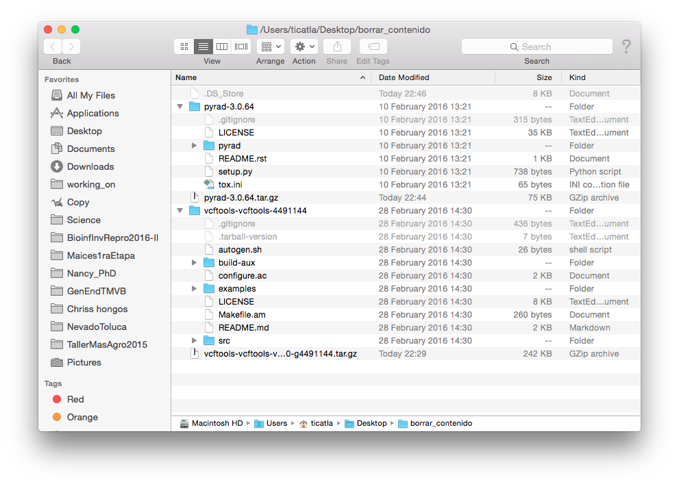

# Unidad 5 Uso general de software especializado

## 5.1. Utilidad de software especializado 		

El sofware especializado permite realizar operaciones complejas con datos genéticos y preguntas biológicas de un tipo particular. 

Por ejemplo el ensamblado *de novo* de datos de GBS/RAD, puede hacerse con diferente software dependiendo de si las preguntas biológicas están enfocadas en genéticade poblaciones (Stacks), filogenética (pyRAD) o diversidad de cultivos (UNEAK-TASSEL). 


## 5.2. Cómo entender la instalación y documentación de software especializado

### Instalación 
El sofware especializado en bioinformática en su mayoría corre directamente desde la línea de comando en Linux o Mac y está escrito en lenguajes como C++, python y Perl, entre otros. Por ende, su instalación no es dar dos clicks, sino realizar una serie de pasos, en su mayoría involucrando los siguientes:

1) Busca la versión más reciente del sofware especializado de tu interés. Por lo general tienen su propia página en algún rincón del internet.

Veamos dos ejemplos:

[VCFtools](http://vcftools.github.io/index.html)
[pyRAD](http://dereneaton.com/software/pyrad/)

2) Busca la sección de **Download**, o **Install**. Normalmente te llevarán a bajar un tar o a un comando para bajar el tar desde Github. 

3). Baja el **source code** del programa.

Si vemos el contenido de los tar que bajamos veremos algo así:



4. Por lo general el tar con el source code incluye un archivo de texto (o Markdown) llamado **README**, pero también puede llamarse **INSTALL**. Este es el primer archivo que siempre debemos consultar (y si tanto README como INSTALL existen, primero README).

Así se ve el de pyRAD:


Y así el de VCFtools:


5. La instalación consiste en seguir los pasos que nos dice el README (o el link que contenga el README, a veces pasa).

**Puntos a observar**: 

* La instalación varía de programa a programa
* La instalación puede requerir los comandos:
  - `sudo`
  - `./configure`
  - `make`
  - `make install`
* Nuestro software de interés puede requerir **dependencias**, es decir otros programas o librerías (de python, Perl, etc) para poder correr. 
* Algunas de esos otros programas pueden instalarse a través de programas para instalar cosas, como `pip`, `brew`, etc. 

#### ¿Qué hacen `sudo`, `./configure`, `make` y `make install`?

Bonita referencia [aquí](https://robots.thoughtbot.com/the-magic-behind-configure-make-make-install)

#####`sudo`: 

Te vuelve el *super usuario*, es decir eres un todo poderoso administrador que puede hacer lo que sea con la línea de comando sin que la computadora te diga que no.

xkcd lo explica así: 


Debemos usar `sudo` ya que al correr como usuarios normales no tenemos privilegios de administrador, lo cual es una medida de seguridad para que no corran programas que se metan con nuestro sistema sin nuestra autorización, y también para revisar que sabes lo que haces antes de modificar algo importante en el sistema. 


##### `./configure`:

Para correr esto primero **debes** estar en el tar (descomprimido) del programa que acabas de bajar. La razón es que esta línea de comando corre un script llamado `configure` (que es un ejecutable) que **viene con tu programa**. 

Un script `configure` básicamente revisa que la computadora donde vas a instalar el programa tenga las dependencias que el programa necesita. En ocasiones puede decirte que no las tiene, pero que amablemente las baja por tí. En tal caso te lo preguntará, con al final de la pregunta un paréntesis así `(Y/n)`, tienes que decirle si Yes or Not. 

Si algunos de los requisitos importantes no se puede conseguir `configure` marcará error y no podrás continuar con la instalación hasta que tengas esas dependencias en orden (o sea que las instales por ti misma). Este suele ser el paso más doloroso de instalaciones difíciles.

Si todo sale bien configure habrá **creado** un nuevo archivo en nuestro WD (que sigue siendo el descomprimido del tar del programa en cuestión) llamado **MakeFile**, puedes pasar al siguiende paso:

##### `make`:

`make` es un programa de Unix que corre un archivo `MakeFile` que se encuentre en el WD. Este archivo (que creamos con `configure` en el paso anterior) es ligeramente diferente dependiendo de cada computadora, es decir, está personalizado para tu computadora, por eso no viene en el tar que bajamos. 

El `MakeFile` indica la secuencia de comandos que se necesitan seguir para construir (*build*) los componentes o sub-programas del software y crea los ejecutables necesarios. A esto también se le conoce como *compilación*.

Si todo sale bien, puedes seguir al último paso:

##### `make install`: 

`make install` también corre el archivo `MakeFile`, pero sólo una sección dentro de dicho archivo llamada **Install**. Esta sección contiene instrucciones para que los archivos creados por el paso anterior (`make`) se copien a sus directorios destino dentor de tu computadora, por ejemplo `/usr/local/bin` para que cualquier usuario los pueda correr. Si fue necesario instalar dependencias, estas también se copiarán al lugar que les corresponda (se crearon en el paso anterior, pero vivían en un directorio temporal). 

Muy probablemente en este paso tu terminal te dirá que no tienes autorización (`Permission denied`) si intentas correr `make install`. Aquí es cuando entra `sudo`, así:

`sudo make install`

(Te pedirá tu pasword, dáselo). 


### Documentación 

La **documentación** de un programa bioinformático (y de cualquier sofware) se refiere al **manual** y tutoriales asociados al programa. 

Dos maneras de encontarlos:

* Dentro del programa (e.g. `man vcftools` o vcftools -help)
* En internet (en la página del software)

### Docker

_logo.png)

Docker sirve para crear **contenedores** y poner dentro de ellos un softaware (o varios) junto con todo lo que necesitan para correr: su sistema de archivos, código, herramientas del sistema, librerías, etc, cualquier cosa que normalmente podamos instalarle a un sistema operativo.

Terminología básica:

* Un **contenedor** es una versión de Linux reducida a sus componentes más básicos. 

* Una **imagen** es el sofware que cargamos en un contenedor. 

* Un **dockerfile** describe el sofware que pondremos en una imagen, pero esto no incluye sólo el programa en sí, sino también cualquier detalle de la configuración del ambiente y hasta los comandos que queremos corra.


Esto nos permite que un programa corra de manera idéntica sin importar el sistema operativo original del equipo, y hace que la instalación sea independiente de la instalación de otro software. Esto es importante porque al instalar un programa bioinformático es común "romper" las dependencias de otro programa.

Funciona también con Windows (7 onwards, 64 bit). Por lo que esto es una alternativa a hacer una partición de disco o a correr Ubunto/Biolinux desde VirtualBox (docker es mucho más ligero, aunque hagan cosas parecidas).


En el siguiente link puedes encontrar las instrucciones para instalar Docker en tu computadora (cambiar tutorial según OS). Traerlo instalado para la próxima clase.

[Tutorial instalación y primeros pasos de Docker](https://docs.docker.com/mac/).

Y aquí unos videos de referencias extra, por si les quieres dar un ojo: [Tutoriales en video](https://training.docker.com/self-paced-training).

Este es un ejemplo de lo que prodremos hacer una vez tengas instalado docker:

Primero bajamos la última versión de ubuntu

```
$ docker pull ubuntu #Baja la última versión de ubuntu 
Using default tag: latest
latest: Pulling from library/ubuntu

5a132a7e7af1: Pull complete 
fd2731e4c50c: Pull complete 
28a2f68d1120: Pull complete 
a3ed95caeb02: Pull complete 
Digest: sha256:4e85ebe01d056b43955250bbac22bdb8734271122e3c78d21e55ee235fc6802d
Status: Downloaded newer image for ubuntu:latest
```
 
Revisamos tenerla:

```
$ docker images #Enlista imagenes ya bajadas
REPOSITORY          TAG                 IMAGE ID            CREATED             SIZE
ubuntu              latest              07c86167cdc4        11 days ago         188 MB
hello-world         latest              690ed74de00f        5 months ago        960 B
docker/whalesay     latest              6b362a9f73eb        9 months ago        247 MB
```    

Corremos la imagen. Voilá, estamos dentro de un Ubuntu
      
```
$ docker run -it ubuntu bash
root@740df4e6d81e:/# 
root@740df4e6d81e:/# ls
bin   dev  home  lib64  mnt  proc  run   srv  tmp  var
boot  etc  lib   media  opt  root  sbin  sys  usr
```

**Pregunta**: ¿Qué significa el `#` en vez del `$`?


Es una verisón tan básica de Ubuntu que prácticamente nada viene pre-instalado. Por eso es buena idea correr esto:

```
# apt-get update
Ign http://archive.ubuntu.com trusty InRelease
Get:1 http://archive.ubuntu.com trusty-updates InRelease [65.9 kB]
Get:2 http://archive.ubuntu.com trusty-security InRelease [65.9 kB]
Hit http://archive.ubuntu.com trusty Release.gpg     
Hit http://archive.ubuntu.com trusty Release         
Get:3 http://archive.ubuntu.com trusty-updates/main Sources [328 kB]
Get:4 http://archive.ubuntu.com trusty-updates/restricted Sources [5217 B]
Get:5 http://archive.ubuntu.com trusty-updates/universe Sources [190 kB]
Get:6 http://archive.ubuntu.com trusty-updates/main amd64 Packages [910 kB]    
Get:7 http://archive.ubuntu.com trusty-updates/restricted amd64 Packages [23.5 kB]
Get:8 http://archive.ubuntu.com trusty-updates/universe amd64 Packages [440 kB]
Get:9 http://archive.ubuntu.com trusty-security/main Sources [134 kB]          
Get:10 http://archive.ubuntu.com trusty-security/restricted Sources [3920 B]   
Get:11 http://archive.ubuntu.com trusty-security/universe Sources [39.1 kB]    
Get:12 http://archive.ubuntu.com trusty-security/main amd64 Packages [542 kB]  
Get:13 http://archive.ubuntu.com trusty-security/restricted amd64 Packages [20.2 kB]
Get:14 http://archive.ubuntu.com trusty-security/universe amd64 Packages [162 kB]
Get:15 http://archive.ubuntu.com trusty/main Sources [1335 kB]                 
Get:16 http://archive.ubuntu.com trusty/restricted Sources [5335 B]            
Get:17 http://archive.ubuntu.com trusty/universe Sources [7926 kB]             
Get:18 http://archive.ubuntu.com trusty/main amd64 Packages [1743 kB]          
Get:19 http://archive.ubuntu.com trusty/restricted amd64 Packages [16.0 kB]    
Get:20 http://archive.ubuntu.com trusty/universe amd64 Packages [7589 kB]      
Fetched 21.5 MB in 27s (778 kB/s)                                              
Reading package lists... Done
```

Y ahora sí, podemos instalar herramientas, por ejemplo `curl`:

```
# apt-get install curl
```

Nota que si sales (`exit`) de esta imágen y la vuelves a correr tus cambios se habrán perdido. Adelante veremos como evitar esto, y cómo crear contenedores más complejos a través de un *dockerfile*.


