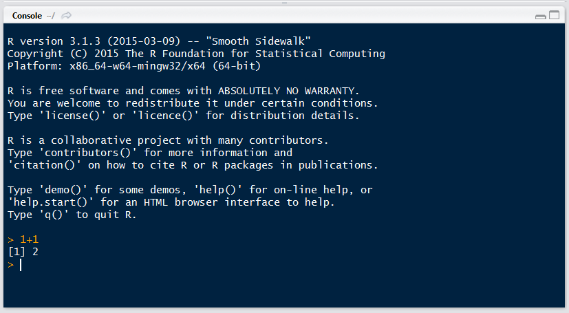
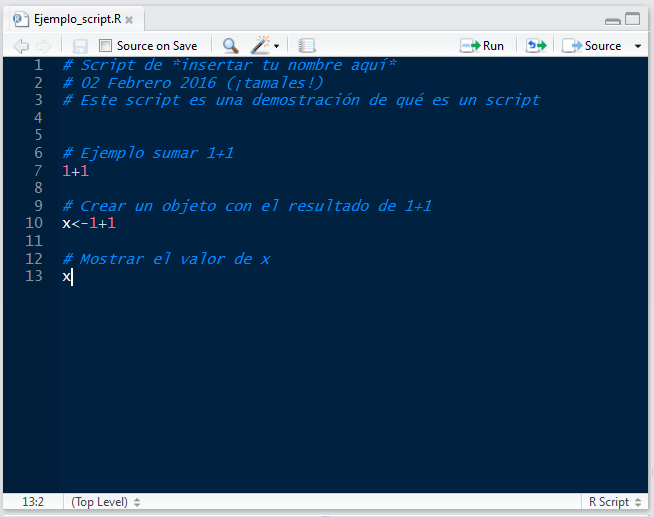

# Unidad 7 Introducción a R con un enfoque bioinformático

## 7.1. R y RStudio 		

### ¿Qué es R?
* R es un lenguaje de programación y un ambiente de cómputo estadístico
* R es software libre (no dice qué puedes o no hacer con el software), de código abierto (todo el código de R se puede inspeccionar - y se inspecciona).
* Cuando instalamos R, instala la base de R. Mucha de la funcionalidad adicional está en **paquetes** que la comunidad crea.

### ¿Por qué R?
* R funciona en casi todas las plataformas (Mac, Windows, Linux e incluso en Playstation 3).
* R es un lenguaje de programación completo, permite desarrollo de DSLs (funciones muy específicas)
* R promueve la investigación reproducible: no sólo de análisis sino de cómo se hicieron las figuras.
* R está actualizado gracias a que tiene una activa comunidad. Solo en CRAN hay cerca de 8000 paquetes (funcionalidad adicional de R creadas creada por la 
comunidad).
* R se puede combinar con herramientas bioinformáticas y formatos de datos procesados (e.g. plink, vcf, etc) para realizar análisis y figuras.
* R tiene capacidades gráficas muy sofisticadas.
* R es popular como herramienta estadística ([la guerra del software](http://datacamp.wpengine.com/wp-content/uploads/2014/05/infograph.png)) y cada vez más también como herramienta bioinformática ()


### Descargar R y RStudio
Para comenzar se debe descargar [R](https://cran.r-project.org), esta descarga incluye R básico y un editor de textos para escribir código. Después de descargar R se recomienda descargar [RStudio](https://www.rstudio.com/products/rstudio/download/) (gratis y libre).

**RStudio** es un ambiente de desarrollo integrado para R: incluye una consola, un editor de texto y un conjunto de herramientas para administrar el espacio de trabajo cuando se  utiliza R. 


### ¿Cómo entender R?
* Hay una sesión de R corriendo. La consola de R es la interfaz entre R y nosotros. 
* En la sesión hay objetos. Todo en R es un objeto: vectores, tablas,  funciones, etc.
* Operamos aplicando funciones a los objetos y creando nuevos objetos.

##### La consola
Es una ventana que nos permite comunicarnos al motor de R. Esta ventana acepta **comandos** en el lenguaje de R y brinda una respuesta (resultado) a dichos comandos. 

Por ejemplo, le podemos pedir a R que sume 1+1 así:

```
1+1
```    

La consola se distingue por tener el símbolo `>` seguido de un cursor parpadeante que espera a que le demos instrucciones (cuando recién abrimos R además muestra la versión que tenemos instalada y otra info).

Tu Consola debe verse más o menos así después del ejemplo anterior:




##### Scripts y el editor

Como hemos visto en otras unidades, un **script** es un archivo de nuestros análisis que es:

* un archivo de texto plano 
* permanente,
* repetible,
* antoado,
* compartible y 
* compatible con otras plataformas

En otras palabras, un script es una recopilación por escrito de las instrucciones que queremos enviar a la consola, de modo que al tener esas instrucciones cualquiera pueda repetir el análisis tal cual se hizo. 

Un script muy sencillo podría verse así:



"Ejemplo_script.R" es el nombre del archivo, es decir, que este texto es un **archivo de texto** (con terminación .R en vez de .txt) que vive en mi computadora.


RStudio brinda además de la consola un editor de texto, que es la pantalla que se observa en el ejemplo anterior. Lo que escribas en el editor de texto puede "enviarse" a la consola con los shortcuts de abajo o con el ícono correr. 

La idea es que en el editor de texto vayas escribiendo los comandos y comentarios de tu **script** hasta que haga exactamente lo que quieras. 


### Algunos _shortcuts_ útiles en RStudio son:

**En el editor**  

* command/ctrl + enter: enviar código a la consola  
* ctrl + 2: mover el cursor a la consola

**En la consola**  

* flecha hacia arriba: recuperar comandos pasados  
* ctrl + flecha hacia arriba: búsqueda en los comandos  
* ctrl + 1: mover el cursor al editor  
* ? + nombre de función: ayuda sobre esa función.


## 7.2. Funciones básicas de R más importantes para bioinformática 

### Introducción a R como lenguaje de programación

Antes de pasar a las funciones bionformáticas, veamos la sintaxis básica de R y los principales comandos que aprender.  
		
http://tryr.codeschool.com/

* Expresiones matemáticas: `1+1`
* Strings de texto: `"¡Holaaaaa mundo!"`
* Valores lógicos: `1<5`, `2+2 ==5`
* Crear una variable: `x<-5`

* Funciones: son un comando que hace algo específico dentro de R. Ejemplo: `sum()`, `mean()`, `help()`

**Ejercicio**: crea una variable con el logaritmo base 10 de 50 y súmalo a otra variable cuyo valor sea igual a 5.

Vectores:
* vectores `c(5, 4, 6, 7)`, `5:9`
* Acceso a elementos de un vector `[]` 

**Ejercicio:** suma el número 2 a todos los números entre 1 y 150. 

Matrices
* Matrices `matrix(0, 3, 5)`
* Acceso a elementos e una matriz `[ , ]`

Data frames
* Data frame `data.frame(x = c("a", "b", "c"), y = 1:3)`
* Acceso a elementos e una data.frame `[ , ]`, `$`

* Funciones de sistema: `list.files()`, `getwd`, `setwd`
* Cargar una función: `source`

## 7.3. Graficar en R 		

## 7.4. Bioconductor y paquetes bioinformáticos en R